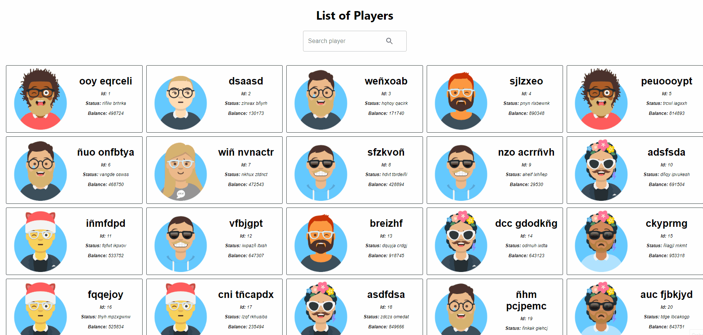
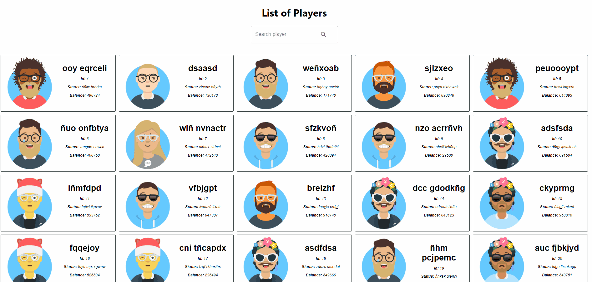

<h1 align="center"> 
    Players app 
</h1>

  

Project to show the list of players from the [Api Players](https://playersapinest.herokuapp.com/api/v1/players),
this a repository relative: [Api Players repository](https://github.com/franciscoquijada/players-backend-nestjs).

Features:

- **Deploy Players:** The first 20 players are displayed and can be navigated using pagination.
  
- **Search players:** If the search text is an exact match to a player id, only this match is displayed. Otherwise it shows all matches using the nickname and status attributes.
  

It was built in [react 17](https://es.reactjs.org/) together with the component library [MUI](https://mui.com/).

## Instructions to execute:

- Clone this repository.
- Go to the root directory of the project.
- Create file .env with this content: `https://playersapinest.herokuapp.com/api/v1/`.
- Install the dependencies with this command: `npm install` or `yarn install`.
- Execute the project: `npm start`.
- By defect the aplication run in the port 8000, you can change it in the package.json file in the section 'scripts', you should find the key 'start' and assign the value PORT. 

## About Tests
In this application exist unit test in [Jest](https://jestjs.io/) and [React Testing Library](https://testing-library.com/), these are the related commands:
- Run all unit test: `npm run test`
- Run coverage: `npm run test:cov`

## Execute tests:
- Execute all unit test: `npm run test`. 

There are also end to end tests in [cypress](https://www.cypress.io/),
you must create a file named cypress.json (for enviroments data) in the root of the project with the following structure:
Where URL_PAGE is the url of the application.

`{
    "env": {
        "URL_PAGE": "http://localhost:8000/"
    }
}`

these are the related commands:

- Open cypress: `npm run cypress:open`

You can see the project deployed in Heroku:
[https://playersfront.herokuapp.com/](https://playersfront.herokuapp.com/)

